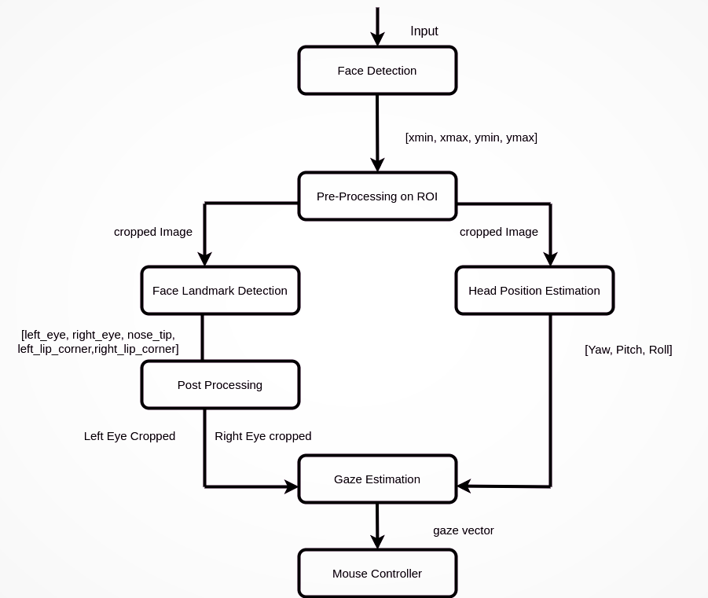
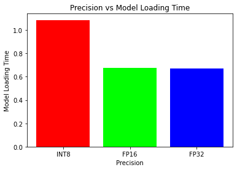
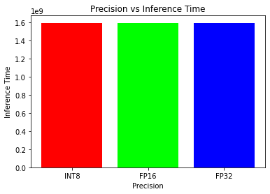
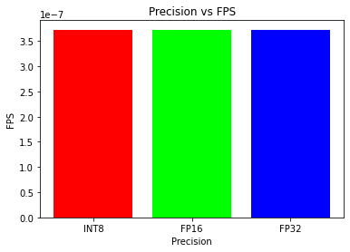

# Computer Pointer Controller

In this project, I used the gaze detection model to control the mouse pointer of my computer. I've used the **`[Gaze Estimation](https://docs.openvinotoolkit.org/latest/_models_intel_gaze_estimation_adas_0002_description_gaze_estimation_adas_0002.html)`** model to estimate the gaze of the my eyes and changed the mouse pointer position accordingly. In this project I have demonstrated the ability to run multiple models in the same machine and coordinate the flow of data between those models.

## How it works

You will be using the Inference Engine API from Intel's OpenVino ToolKit to build this project. The **gaze estimation** model requires three inputs:

- The head pose
- The left eye image
- The right eye image.

To get these inputs, I have to used three other OpenVino models:

- [Face Detection](https://docs.openvinotoolkit.org/latest/_models_intel_face_detection_adas_binary_0001_description_face_detection_adas_binary_0001.html)
- [Head Pose Estimation](https://docs.openvinotoolkit.org/latest/_models_intel_head_pose_estimation_adas_0001_description_head_pose_estimation_adas_0001.html)
- [Facial Landmarks Detection](https://docs.openvinotoolkit.org/latest/_models_intel_landmarks_regression_retail_0009_description_landmarks_regression_retail_0009.html).


## The Pipeline

I have coordinated the flow of data from the input, and then amongst the different models and finally to the mouse controller. The flow of data will look like this:



## Project Set Up and Installation

### Install Intel® Distribution of OpenVINO™ toolkit for Windows* 10

### 1. Hardware Requirements for Installation (any one)

1. 6th-10th Generation Intel® Core™ processors
2. Intel® Xeon® v5 family
3. Intel® Xeon® v6 family
4. Intel® Movidius™ Neural Compute Stick
5. Intel® Neural Compute Stick 2
6. Intel® Vision Accelerator Design with Intel® Movidius™ VPUs

#### 2. Software Setup

Your installation is complete when these are all completed:

1. Install the [[Intel® Distribution of OpenVINO™ toolkit core components]](https://docs.openvinotoolkit.org/latest/openvino_docs_install_guides_installing_openvino_windows.html#Install-Core-Components)

2. Install the dependencies:

   - [[Microsoft Visual Studio* with C++ **2019 or 2017** with MSBuild]](http://visualstudio.microsoft.com/downloads/)

   - [[CMake **2.8.12 or higher** 64-bit]](https://cmake.org/download/)

     > **NOTE**: If you want to use Microsoft Visual Studio 2019, you are required to install CMake 3.14.**NOTE**: If you want to use Microsoft Visual Studio 2019, you are required to install CMake 3.14.

   - [[Python **3.5** - **3.7** 64-bit]](https://www.python.org/downloads/windows/)

   3. [[Set Environment Variables]](https://docs.openvinotoolkit.org/latest/openvino_docs_install_guides_installing_openvino_windows.html#set-the-environment-variables)
   4. [[Configure the Model Optimizer]](https://docs.openvinotoolkit.org/latest/openvino_docs_install_guides_installing_openvino_windows.html#Configure_MO)
   5. Run two [[Verification Scripts to Verify Installation]](https://docs.openvinotoolkit.org/latest/openvino_docs_install_guides_installing_openvino_windows.html#Using-Demo-Scripts)

## Demo

1. First step isto clone this gitHub repository into your local machine using `git clone`  coommand and change your working directory to cloned repo directory using `cd` command.

   ​	

   ```shell
   git clone https://github.com/MrinmoiHossain/ComputerPointerController.git
   ```

   ```bash
   cd ComputerPointerController
   ```

2. Create a virtual environment for the project.

   ```python
   python3 -m venv ComputerPointerController
   ```

3. After Creating the virtual environment activate it as below

   ```bash
   ComputerPointerController/bin/activate
   ```

   ```bash
   source /opt/intel/openvino/bin/setupvars.sh
   ```

4. Install all the dependency packages for the project.

   ```python
   pip3 install -r requirements.txt
   ```

5. Run the `main.py` file.

## Documentation
#### Project File Structure

```bash
ComputerPointerController 
| — bin
|    | — demo.mp4 
| — img
|
|    | — pipeline.png
|    | — precision-vs-FPS.png 
|    | — precision-vs-inference-time.png
|    | — precision-vs-model-loading-time.png
| — README.md 
| — requirements.txt 
| — src 
|    | — face_detection.py 
|    | — facial_landmarks_detection.py 
|    | — gaze_estimation.py 
|    | — head_pose_estimation.py 
|    | — input_feeder.py 
|    | — main.py mouse controller. 
```

#### Command Line Arguments for Running the app

Following are commanda line arguments that can use for while running the main.py file `python main.py`:-

1. `-h`: Get the information about all the command line arguments
2. `-fl` (required) : Specify the path of Face Detection model's xml file
3. `-hp` (required) : Specify the path of Head Pose Estimation model's xml file
4. `-g `(required) : Specify the path of Gaze Estimation model's xml file
5. `-i` (required) : Specify the path of input video file or enter cam for taking input video from webcam
6. `-d` (optional) : Specify the target device to infer the video file on the model. Suppoerted devices are: CPU, GPU, FPGA.
7. `-l` (optional) : Specify the absolute path of cpu extension if some layers of models are not supported on the device.
8. `-prob` (optional) : Specify the probability threshold for face detection model to detect the face accurately from video frame.
9. `-flags` (optional) : Specify the flags from fd, fld, hp, ge if you want to visualize the output of corresponding models of each frame (write flags with space seperation.).

## Benchmarks
In this project, I have checked Inference Time, FPS and Model Loading Time for INT8, FP16, FP32. The output graphs of the test are given below:

#### Model Loading Time



### Inference Time



### FPS (Frames per Second)



## Results

**`GPU`** proccesed more FPS while compared to any other hardware and specially when model precision is FP16 because GPU has severals Execution units and their instruction sets are optimized for 16 bit floating point data types.

I have run models with different precision, but precision affects the accuracy. Model size can reduce by lowing the precision from INT8 and FP16, FP32 and inference becomes faster but because of lowing the precision model can lose some of the important information because of that accuracy of model can decrease.

## Stand Out Suggestions
### Edge Cases
When I tried for are more than one face  and it detected in the frame then model takes the first detected face for control the mouse pointer.
